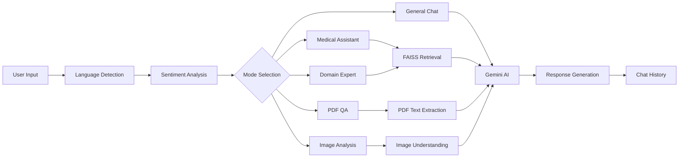

# Final AI Assistant – Multi-Modal Intelligent Knowledge Assistant 🤖


## Project Overview

**Final AI Assistant** is a multi-modal AI-powered chatbot developed using **Python**, **Streamlit**, **Google Gemini AI**, **FAISS Vector Database**, **Sentence Transformers**, the **MedQuAD medical dataset**, and an **arXiv research paper dataset**.

It combines general conversational AI, medical question answering, research paper exploration, PDF document question answering, image understanding, sentiment analysis, multilingual support, and context-aware chat history into a single production-style interface.

### Professional Summary

| Item | Details |
|---|---|
| Repository | [Final-AI-Assistant](https://github.com/dhanya-12366/Final-AI-Assistant) |
| Project Type | Multi-modal AI Knowledge Assistant |
| Interface | Streamlit Web Application |
| Core AI Engine | Google Gemini |
| Retrieval Layer | FAISS + Sentence Transformers |
| Use Cases | Medical QA, Research QA, PDF QA, Image Analysis, General Chat |

## Features

- ✨ General AI Chatbot powered by Google Gemini AI
- 🩺 Medical Question Answering using the MedQuAD dataset
- 📚 Domain Expert Chatbot using arXiv research papers
- 📄 PDF upload and question answering
- 🖼️ Image analysis and understanding
- 🌍 Multi-language support
- 🔎 Automatic language detection
- 😊 Sentiment analysis
- 🧠 Chat history and context management
- ⚡ FAISS-based vector retrieval
- 🖥️ Streamlit user interface

## System Architecture

The chatbot follows a retrieval-augmented workflow:



### How It Works

1. The user submits a prompt through the Streamlit interface.
2. The system detects the input language and sentiment.
3. A mode is selected based on the user’s task.
4. Relevant context is retrieved from the appropriate FAISS index or uploaded file.
5. Gemini generates a context-aware response.
6. The answer is displayed and stored in chat history for the ongoing session.

## Folder Structure

```text
Final_AI_Assistant/
├── src/
│   └── final_chatbot.py
├── vector_db/
├── screenshots/
├── docs/
├── README.md
├── requirements.txt
├── .gitignore
├── PROJECT_REPORT.md
└── LICENSE
```

### Actual Project Assets

| Path | Purpose |
|---|---|
| `src/final_chatbot.py` | Main Streamlit application |
| `vector_db/arxiv.index` | FAISS index for research paper retrieval |
| `vector_db/documents.pkl` | Serialized arXiv documents |
| `../Medical_QA_Chatbot/medical_vector_db/medical.index` | MedQuAD FAISS index |
| `../Medical_QA_Chatbot/medical_vector_db/medical.pkl` | MedQuAD serialized documents |

## Installation Guide

### 1. Clone the repository

```bash
git clone https://github.com/dhanya-12366/Final-AI-Assistant.git
```

### 2. Navigate to the project folder

```bash
cd Final-AI-Assistant
```

### 3. Install dependencies

```bash
pip install -r requirements.txt
```

## Environment Variable Setup

Create a `.env` file in the project root and add your Gemini API key:

```env
GOOGLE_API_KEY=your_api_key_here
```

## Running the Application

```bash
streamlit run src/final_chatbot.py
```

## Usage Examples

| Mode | Example Usage |
|---|---|
| Medical Assistant | Ask health-related questions such as symptoms, conditions, or treatments. |
| Domain Expert | Request technical explanations from the research-paper knowledge base. |
| PDF Question Answering | Upload a PDF and ask questions about its content. |
| Image Analysis | Upload an image and request a description or analysis. |
| General Chat | Ask open-ended questions, summaries, or conversational prompts. |

## Screenshots

### Home Page


### Medical Assistant


### Domain Expert


### PDF QA


### Image Analysis


## Results

The project successfully integrates multiple AI capabilities into a single assistant:

- Medical QA is supported through FAISS retrieval over the MedQuAD dataset.
- Research paper retrieval is enabled through the arXiv vector database.
- Sentiment analysis helps interpret the tone of user input.
- Multilingual support and automatic language detection improve accessibility.
- Image understanding enables visual reasoning with uploaded images.
- PDF QA converts uploaded documents into searchable context for question answering.

## Future Enhancements

- Voice Assistant
- Real-Time Web Search
- User Authentication
- Personalized Memory
- Advanced Analytics Dashboard

## Professional Project Description

### GitHub Repository Description
A production-style multi-modal AI assistant built with Streamlit, Gemini, FAISS, and Sentence Transformers for general chat, medical QA, research retrieval, PDF analysis, image understanding, multilingual support, and sentiment-aware responses.

### LinkedIn Project Post
Built **Final AI Assistant – Multi-Modal Intelligent Knowledge Assistant**, a Streamlit-powered AI application that unifies Gemini-based chat, medical QA with MedQuAD, research-paper retrieval with arXiv, PDF question answering, image analysis, language detection, and sentiment analysis into one intelligent interface.

### Internship Submission Summary
Final AI Assistant is a comprehensive AI project demonstrating practical implementation of retrieval-augmented generation, multimodal reasoning, and knowledge-centric chatbot design using modern Python AI tools.

## Author

**Dhanyashri**

## License

This project is licensed under the MIT License. See the [LICENSE](LICENSE) file for details.